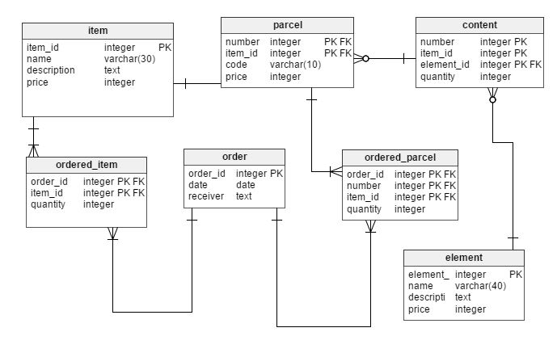

# PostgreSQL Cheatsheet - CREATE

## Rule

[https://www.postgresql.org/docs/9.2/static/sql-createrule.html](https://www.postgresql.org/docs/9.2/static/sql-createrule.html)

### Syntax

```sql
CREATE [ OR REPLACE ] RULE name AS ON event
    TO table_name [ WHERE condition ]
    DO [ ALSO | INSTEAD ] { NOTHING | command | ( command ; command ... ) }
```

### Example

```sql
CREATE RULE rule_name AS
ON UPDATE
TO table_name_1
DO INSTEAD -- table_name_1 won't be updated
  UPDATE
    table_name_2
  SET
    (val1 = NEW.val1)
  WHERE
    some_id = NEW.some_id;
```

## View

[https://www.postgresql.org/docs/9.2/static/sql-createview.html](https://www.postgresql.org/docs/9.2/static/sql-createview.html)

### Syntax

```sql
CREATE [ OR REPLACE ] [ TEMP | TEMPORARY ] VIEW name [ ( column_name [, ...] ) ]
    [ WITH ( view_option_name [= view_option_value] [, ... ] ) ]
    AS query
```

### Example

```sql
CREATE VIEW view_name
AS
  SELECT
    t1.col1 AS column_1,
    t2.col2 AS column_2
  FROM table_name_1 AS t1
  NATURAL JOIN table_name_2 AS t2;
```

## Trigger

[https://www.postgresql.org/docs/9.2/static/sql-createtrigger.html](https://www.postgresql.org/docs/9.2/static/sql-createtrigger.html)

### Syntax

```sql
CREATE [ CONSTRAINT ] TRIGGER name { BEFORE | AFTER | INSTEAD OF } { event [ OR ... ] }
    ON table_name
    [ FROM referenced_table_name ]
    [ NOT DEFERRABLE | [ DEFERRABLE ] { INITIALLY IMMEDIATE | INITIALLY DEFERRED } ]
    [ FOR [ EACH ] { ROW | STATEMENT } ]
    [ WHEN ( condition ) ]
    EXECUTE PROCEDURE function_name ( arguments )

where event can be one of:

    INSERT
    UPDATE [ OF column_name [, ... ] ]
    DELETE
    TRUNCATE
```

### Example

```sql
DROP TRIGGER trigger_name_1 ON table_name_1;
CREATE TRIGGER trigger_name_1
AFTER INSERT OR UPDATE
ON table_name_1
FOR EACH ROW
WHEN (
  OLD.* IS DISTINCT FROM NEW.*
)
EXECUTE PROCEDURE function_to_be_triggered();
```

## Function

[https://www.postgresql.org/docs/9.2/static/sql-createfunction.html](https://www.postgresql.org/docs/9.2/static/sql-createfunction.html)

### Syntax

```sql
CREATE [ OR REPLACE ] FUNCTION
    name ( [ [ argmode ] [ argname ] argtype [ { DEFAULT | = } default_expr ] [, ...] ] )
    [ RETURNS rettype
      | RETURNS TABLE ( column_name column_type [, ...] ) ]
  { LANGUAGE lang_name
    | WINDOW
    | IMMUTABLE | STABLE | VOLATILE | [ NOT ] LEAKPROOF
    | CALLED ON NULL INPUT | RETURNS NULL ON NULL INPUT | STRICT
    | [ EXTERNAL ] SECURITY INVOKER | [ EXTERNAL ] SECURITY DEFINER
    | COST execution_cost
    | ROWS result_rows
    | SET configuration_parameter { TO value | = value | FROM CURRENT }
    | AS 'definition'
    | AS 'obj_file', 'link_symbol'
  } ...
    [ WITH ( attribute [, ...] ) ]
```

### Example

```sql
CREATE OR REPLACE FUNCTION function_name_1 (
  id_of_record_to_process integer,
  TEXT -- second argument accessible under $2
)
RETURNS BOOLEAN
AS $$
  DECLARE is_equal BOOLEAN
  BEGIN

    SELECT (name = $2) INTO is_equal
    FROM table_name_1
    WHERE id = id_of_record_to_process;

    RETURN is_equal;

  END;
$$ LANGUAGE plpgsql;
-- Called as
SELECT * FROM function_name_1(
  2,
  'Lucky Dude'
);
```

## Table

[https://www.postgresql.org/docs/9.2/static/sql-createtable.html](https://www.postgresql.org/docs/9.2/static/sql-createtable.html)

### Syntax

```sql
CREATE [ [ GLOBAL | LOCAL ] { TEMPORARY | TEMP } | UNLOGGED ] TABLE [ IF NOT EXISTS ] table_name ( [
  { column_name data_type [ COLLATE collation ] [ column_constraint [ ... ] ]
    | table_constraint
    | LIKE source_table [ like_option ... ] }
    [, ... ]
] )
[ INHERITS ( parent_table [, ... ] ) ]
[ WITH ( storage_parameter [= value] [, ... ] ) | WITH OIDS | WITHOUT OIDS ]
[ ON COMMIT { PRESERVE ROWS | DELETE ROWS | DROP } ]
[ TABLESPACE tablespace_name ]

CREATE [ [ GLOBAL | LOCAL ] { TEMPORARY | TEMP } | UNLOGGED ] TABLE [ IF NOT EXISTS ] table_name
    OF type_name [ (
  { column_name WITH OPTIONS [ column_constraint [ ... ] ]
    | table_constraint }
    [, ... ]
) ]
[ WITH ( storage_parameter [= value] [, ... ] ) | WITH OIDS | WITHOUT OIDS ]
[ ON COMMIT { PRESERVE ROWS | DELETE ROWS | DROP } ]
[ TABLESPACE tablespace_name ]
```

### Example

```sql
-- 1
CREATE TABLE IF NOT EXISTS item
(
  item_id integer PRIMARY KEY,
  name varchar(30),
  description TEXT,
  price integer CHECK ( price > 0 AND price < 1000000)
);
-- 2
CREATE TABLE IF NOT EXISTS "order"
(
  order_id integer PRIMARY KEY,
  "date" date,
  receiver text,
  CHECK ( date > '2016-01-01' AND order_id > -1 )
);
-- 3
CREATE TABLE IF NOT EXISTS element
(
  element_id integer PRIMARY KEY,
  name varchar(40),
  description text,
  price integer -- avoid numeric(5,2)
);
-- 4
CREATE TABLE IF NOT EXISTS ordered_item
(
  order_id integer REFERENCES "order" (order_id), -- (order_id) is not required
                                                -- if the column name in "order" is the same
  item_id integer REFERENCES item,
  quantity integer,
  PRIMARY KEY ( order_id, item_id )
);
-- 5
CREATE TABLE IF NOT EXISTS parcel
(
  "number" integer,
  item_id integer REFERENCES item,
  code varchar(10),
  price integer,
  PRIMARY KEY ( "number", item_id)
);
-- 6
CREATE TABLE IF NOT EXISTS ordered_parcel
(
  order_id integer REFERENCES "order",
  "number" integer,
  item_id integer,
  quantity integer,
  PRIMARY KEY ( order_id, "number", item_id ),
  FOREIGN KEY ( "number", item_id ) REFERENCES parcel ( "number", item_id)
);
-- 7
CREATE TABLE IF NOT EXISTS content
(
  number integer,
  item_id integer,
  element_id integer REFERENCES element,
  quantity integer,
  PRIMARY KEY ( "number", item_id, element_id ),
  FOREIGN KEY ( "number", item_id ) REFERENCES parcel
);
```
The above code produces schema shown below   
